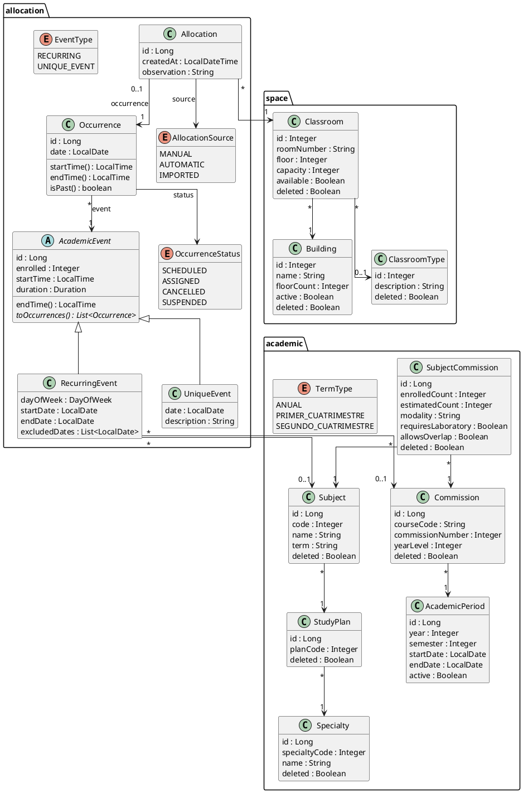

# Modelo de dominio

Documento de referencia del dominio de SIGA (gestión y asignación de aulas para eventos académicos de la UTN FRC). Explica **qué significa cada concepto de negocio** y cómo está materializado en el código. La cadena central del sistema es:

```
AcademicEvent ──genera──▶ Occurrence ──se asigna vía──▶ Allocation ──▶ Classroom
 (qué y cuándo             (cada fecha                  (qué aula, ese día)
  en abstracto)             concreta)
```

Un evento define *qué* pasa y *con qué frecuencia*; cada occurrence es *un día concreto* en que pasa; una allocation dice *en qué aula* ocurre esa occurrence. Las entidades viven en el módulo `allocation` (`src/main/java/ar/edu/utn/frc/siga/allocation/model/`), apoyadas por `space` (aulas) y `academic` (materias/comisiones/períodos).

## Evento académico (`AcademicEvent`)

Abstracción de "reunión en la facultad": algo que junta gente en un aula. Clase abstracta (tabla `evento_academico`, herencia JPA `JOINED`, discriminador `tipo_evento`) con dos hijos concretos:

| Subclase | Tabla | Qué representa | Occurrences que genera |
|---|---|---|---|
| `RecurringEvent` | `evento_recurrente` | Clases regulares (dictado, cursada). Se repite semanalmente dentro de un período | N (una por semana) |
| `UniqueEvent` | `evento_unico_academico` | Mesas de examen final, parciales, trabajos prácticos | 1 |

El enum `EventType` (`RECURRING`, `UNIQUE_EVENT`) espeja los valores del discriminador; se usa para etiquetar el evento al crearlo y en las APIs, pero la fuente de verdad del tipo es la subclase.

Campos comunes (en el padre):

- `enrolled` (`cantidad_inscriptos`): cuánta gente asiste. Es el dato contra el que se contrasta la **capacidad del aula** (tanto en asignación manual como en el solver).
- `startTime` + `duration`: horario del evento. `endTime()` se deriva (`startTime + duration`). **El horario vive en el evento, no en la occurrence** — cambiar el horario del evento cambia el de todas sus occurrences.
- `planningId` (`@Transient`, no persiste): identificador temporal que usa el módulo `solver` para correlacionar el evento con su `SolverEvent` durante una corrida de asignación automática.

### `RecurringEvent`

Clase regular que se dicta un día fijo de la semana:

- `dayOfWeek`: día de la semana en que se dicta (ej. todos los martes).
- `startDate` / `endDate`: ventana del dictado. `endDate` puede ser null → se asume 1 año desde `startDate` al generar occurrences.
- `excludedDates` (tabla `evento_recurrente_fecha_excluida`): fechas puntuales en que NO hay clase. Origen típico: suspensiones de clases, feriados/días no laborables, receso invernal (relevante para eventos anuales). Ver `calendario-academico.md` en esta carpeta.
- `subject` / `commission`: qué materia y qué comisión cursan. Ambos nullable (un recurrente podría no estar atado a materia/comisión). ⚠ Son `@ManyToOne` a entidades de otro módulo — deuda técnica, ver sección de deuda al final.

Generación de occurrences (`toOccurrences()`): parte de `startDate` ajustada al **próximo `dayOfWeek` igual o posterior**, avanza de a 7 días hasta `endDate` inclusive, y saltea las `excludedDates`. Cada occurrence nace en estado `SCHEDULED` — **las occurrences nacen sin aula**; `toOccurrences()` nunca las crea en otro estado.

Nota de calendario: la facultad opera coloquialmente por **cuatrimestres**, pero las clases pueden ser **cuatrimestrales o anuales** (ver `calendario-academico.md`/`.html`). El enum `TermType` del módulo `academic` (ANUAL / PRIMER_CUATRIMESTRE / SEGUNDO_CUATRIMESTRE) modela el dictado y deriva fechas de inicio/fin estándar por año; no está mapeado a columna, es lógica de apoyo (usada p. ej. en importación).

### `UniqueEvent`

Ocurre una sola vez: `date` + `description`. Genera exactamente 1 occurrence. Excepción rara del negocio: mesa especial pedida por alumno, fuera de calendario — sigue siendo un `UniqueEvent` con otra fecha.

## Occurrence

Instancia concreta de un evento en una **fecha específica** (tabla `ocurrencia`). Al crear un evento se generan de una vez todas sus occurrences para el período indicado (ya filtradas las fechas excluidas); no se generan bajo demanda.

- `event`: el `AcademicEvent` padre (obligatorio).
- `date`: la fecha concreta.
- `status` (`OccurrenceStatus`): máquina de estados de 4 valores —
  - `SCHEDULED`: programada, **sin aula** (estado inicial; también adonde vuelve al cancelarse una allocation).
  - `ASSIGNED`: tiene aula (existe una `Allocation` vigente para esta occurrence).
  - `CANCELLED`: cancelada.
  - `SUSPENDED`: suspendida — liberó su aula intencionalmente; a diferencia de `SCHEDULED`, **no** queda pendiente de asignación.
  - Transiciones (centralizadas en `AllocationServiceImpl`): `assignManually()`/`allocateToOccurrences()` pasan la occurrence a `ASSIGNED`; `cancel()` (borra la `Allocation`) la vuelve a `SCHEDULED`. `assignManually()` rechaza occurrences `CANCELLED`/`SUSPENDED`.
- No tiene horario propio: `startTime()`/`endTime()` delegan al evento.
- `isPast()`: true si ya pasó el momento de inicio (`date` + `startTime` del evento vs. ahora). Es el predicado sobre el que gira la restricción de negocio abierta (ver abajo).

## Allocation

Asignación de aula: combinación **Occurrence + Classroom** (tabla `asignacion_aula`). Que un evento esté "asignado" significa que sus occurrences están en estado `ASSIGNED`. Pueden existir occurrences **sin asignar** (`SCHEDULED`) — es un estado válido, no un error, **incluso si la occurrence está próxima a ocurrir o ya ocurrió**. El endpoint `GET /v1/events/unassigned` (módulo `allocation`, `AcademicEventController`) lista, agrupados por evento, los eventos con occurrences en `SCHEDULED` entre un rango de fechas (por defecto desde hoy); excluye `ASSIGNED`/`CANCELLED`/`SUSPENDED`.

⚠ Gap de modelado conocido: hoy no hay forma de distinguir "sin aula porque el dictado es virtual" de "pendiente de asignación" — una clase virtual queda como `SCHEDULED` sin allocation indefinidamente (y aparecería en `/v1/allocations/unassigned`). La suspensión intencional sí tiene marca propia (`SUSPENDED`).

- `occurrence`: `@OneToOne` — una occurrence tiene a lo sumo una allocation vigente.
- `classroom`: el aula asignada (obligatoria). ⚠ `@ManyToOne` a entidad del módulo `space` — deuda técnica.
- `source` (`AllocationSource`): origen de la asignación —
  - `MANUAL`: la decidió una persona por pantalla.
  - `AUTOMATIC`: la produjo el solver (Timefold, módulo `solver`).
  - `IMPORTED`: vino de la importación masiva de Excel (módulo `excelimport`).
- `createdAt`, `observation`: auditoría básica y nota libre.

La granularidad por-occurrence es lo que habilita las variantes de modificación del negocio: cambiar el aula de **un día particular**, o **a partir de un día particular** (se tocan solo las allocations de esas occurrences, el evento no cambia).

### Atomicidad (invariante)

**Toda operación de asignación es atómica: manual, importada o automática (confirm del solver); individual o batch; asignación o reasignación.** Un método = una transacción = todo-o-nada. Si falla cualquier item de un batch → rollback total; nunca queda estado a medias. Los skips de occurrences no-asignables (`continue` en `allocateToOccurrences`) son **filtrado por diseño**, no fallo parcial. Todo camino nuevo (incluido el confirm del solver) debe aplicar sus asignaciones en **una sola transacción** — nada de commit por-asignación ni `REQUIRES_NEW` por item.

### `source` se estampa adentro (intent methods)

`source` **no es parámetro**: lo estampa `allocation` según el intent method que se invoca. Regla: **1 caso de uso → 1 source** (varios casos pueden compartir source). Los nombres describen la intención, no el enum.

| Intent method (`AllocationService`) | `source` | Caso de uso |
|---|---|---|
| `assignManually(occurrenceId, dto)` | `MANUAL` | 1 occurrence, por pantalla |
| `assignManuallyFromDate(dto)` | `MANUAL` | bulk recurrente interactivo, **salta pasadas** |
| `importAssignmentsFromDate(dto)` | `IMPORTED` | bulk recurrente desde import Excel, **incluye pasadas** |
| `applyAutomaticAssignments(plan)` *(pendiente)* | `AUTOMATIC` | confirm de una preview del solver |

Los **paths HTTP no espejan estos nombres**: son orientados a recurso (`POST /v1/allocations/occurrences/{id}`, `/from-date`), el `source` es *cómo* y no va en la URL. Renombrar métodos Java no cambia endpoints.

### Preview del solver (implementado) + confirm (pendiente)

Split preview → confirm, interactivo y sincrónico. **Preview + store implementados; confirm todavía no.**

- **Preview (hecho):** `allocation` orquesta (`AutoAllocationService.autoPreview`) — carga eventos por ID, arma los modelos del solver, junta aulas disponibles y ocupación, y llama a `solver::api`. Endpoints: `POST /v1/allocations/auto-preview` (`{eventIds, timeLimitSeconds}`) y `GET /v1/allocations/auto-preview/{previewId}`. El solver devuelve un `SolverPreview` **lean** (`{previewId, assignments:[{eventId, classroomId}]}`); `allocation` le da forma al cliente (hoy lo devuelve tal cual). Contrato solver = modelos propios (`SolverEvent`, `SolverRoom`, `OccupancyDto`), **sin DTOs con forma HTTP**.
- **Store in-memory (Caffeine) con TTL** (`CaffeinePreviewStore` guarda el `SolverPreview`), para **una sola instancia**; multi-instancia futuro → Redis detrás de `PreviewStore`. TTL en `siga.solver.preview.ttl-minutes`. El **TTL es bound de staleness**, no eviction por memoria: preview vieja se calculó contra un estado DB que ya cambió; y el solver **no es determinista** → la preview es un snapshot puntual, no cache recomputable. Expirada/inexistente → `410 Gone` (`PreviewNotFoundException`).
- **Confirm (pendiente):** `allocation` es dueño (dirección única `allocation → solver::api`, sin ciclo). Cargará la preview por `previewId` y aplicará vía un método intent `applyAutomaticAssignments` que estampa `AUTOMATIC` adentro. **Siempre re-valida contra la DB actual** (aula sigue libre, occurrences siguen `SCHEDULED`), TTL o no; aplica todo el plan en una transacción (atomicidad).

## Restricción de negocio (abierta, sin cerrar)

No debería poder modificarse la asignación de una occurrence ya ocurrida (`isPast()`) — sería "modificar el pasado". Posible excepción: cierto rol con permiso especial. **Esto es una duda abierta del usuario, no una decisión tomada** — no asumir implementación (ni el rol ni la excepción) sin confirmar.

## Restricciones de asignación automática (solver)

Reglas del preview automático (módulo `solver`, orquestado por `allocation`). El diseño original está en `.claude/plans/asignacion-automatica-preview.md` (el contrato se simplificó después: modelos propios en vez de DTOs HTTP, salida `SolverPreview` lean, sin params pinned/excluded).

- **Aulas = todas las disponibles en BD** (`Classroom.available = true`, no `deleted`), no las que envíe el cliente. El request lleva **IDs de evento**; `allocation` carga las occurrences y arma los inputs del solver.
- **HARD — no solapar con asignaciones existentes:** un evento nuevo no puede asignarse a un aula ya ocupada ese día/hora por una `Allocation` existente. Se evalúa **por-ocurrencia** (respeta que una occurrence puntual se haya reasignado a otra aula). Se suma al no-solapamiento entre los eventos nuevos entre sí.
- **SOFT — misma comisión, misma aula/edificio:** eventos regulares de la misma comisión (`commissionKey` = `commission.courseCode`, ej. `1K1`, `2C3`) se prefieren en la **misma aula**; en su defecto en el **mismo edificio**. Preferencia soft: no rompe capacidad ni no-solapamiento; misma-aula pesa más que mismo-edificio. (Si la comisión es null, no agrupa.)
- **Frontera:** el solver es un motor puro (`space::api + common`), **nunca depende de `allocation`**. La ocupación existente se le **inyecta** (dirección única `allocation → solver::api`, evita ciclo con el confirm). Se modela como entidades de planificación **pinned** (inmovibles).
- **Módulo solver mínimo:** contrato por modelos propios (`SolverEvent`, `SolverRoom`, `OccupancyDto` de entrada; `SolverPreview`/`SolverAssignment` de salida — todos `@NamedInterface("api")`). Sin mappers ni DTOs con forma HTTP; las planning entities viven en `model`, el `ConstraintProvider` en `service/impl`. `computeConflicts` arma la adyacencia de conflictos directo (sin `ConflictPair`).
- **Alcance actual:** solo eventos recurrentes (una aula para todas las ocurrencias del evento). Los eventos únicos se incorporan después.
- **Reasignar desde una fecha** (`assignManuallyFromDate`): antes de aplicar valida que **todas** las occurrences objetivo puedan reasignarse sin solapar; si alguna choca, responde `409` con la **lista de occurrences en conflicto** (fecha + evento/allocation que ocupa).

## Entidades de apoyo

- **`space`** — `Building` (edificio, con pisos), `Classroom` (aula: número, piso, `capacity`, flag `available`) y `ClassroomType` (laboratorio, aula común, etc.). `capacity` vs `enrolled` del evento es la comparación clave al asignar.
- **`academic`** — jerarquía académica: `Specialty` → `StudyPlan` → `Subject`; `Commission` pertenece a un `AcademicPeriod` (año + cuatrimestre); `SubjectCommission` es la tabla de unión materia×comisión y carga los atributos que condicionan la asignación (`enrolledCount`, `requiresLaboratory`, `allowsOverlap`, `modality`).
- Casi todas las entidades usan **soft delete** (`deleted`/`eliminado`); no hay borrado físico.

## Diagrama de clases del dominio

Solo entidades de dominio (JPA + enums), agrupadas por módulo. Excluye services, controllers, DTOs y los modelos de planificación del solver (`SolverEvent`/`SolverRoom`, que no son dominio: son copias efímeras que arma el solver para optimizar).



Notas de lectura del diagrama:

- Herencia `AcademicEvent` → `RecurringEvent`/`UniqueEvent` es JPA `JOINED` con discriminador `tipo_evento` (valores del enum `EventType`).
- `TermType` no está mapeado en columna: enum de apoyo (dictado anual/cuatrimestral) que deriva fechas de inicio/fin por año.
- Las flechas `RecurringEvent→Subject/Commission` y `Allocation→Classroom` **cruzan módulos compartiendo entidades JPA** — deuda preexistente documentada en `.claude/plans/deuda-tecnica.md`. La regla para código nuevo es la contraria: referenciar por ID plano y pedir datos a la fachada del otro módulo (el módulo `solver` es el ejemplo limpio).